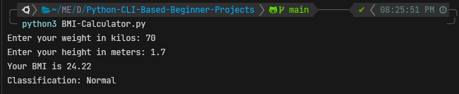

# Beginner friendly Python applications
It is critical to always have the basics of your preferred programming language at
your finger tips. What better way to do this than to practice regularly using simple
but engaging projects. This repository was inspired by the need to relearn, re-inforce,
and get abrest of key Python3 syntax and concepts. Below is a list of the CLI-based projects
accompanied by a highlight of the key concepts covered in each project.

## - BMI Calculator
This is a simple body mass index (BMI) calculator that prompts for weight in kilograms and
height in meters and calculates the BMI value and displays the corresponding classification.

### Key concepts
 - Data types and data type conversion
 - if...else
 - Operators (assignment, addition, subtraction, multiplication, division, exponentiation, comparison)
 - Lists
 - Functions
 - User input

